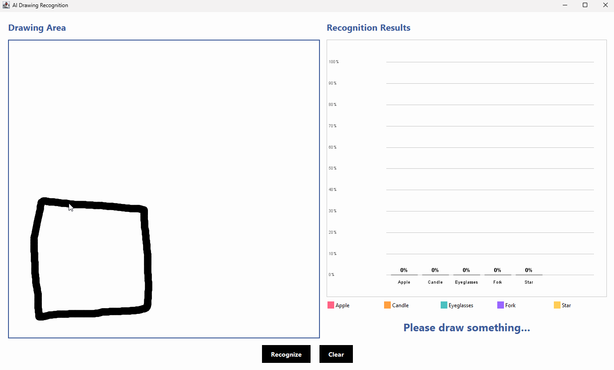

# Pictionary AI — Sketch Classifier


> A Java neural network that classifies hand-drawn sketches from the
> [Google QuickDraw](https://github.com/googlecreativelab/quickdraw-dataset) dataset —
> built entirely from scratch without any ML framework, as a university team project at Leibniz University Hannover.



---

## Results

| Model | Classes | Implementation |
|-------|:-------:|----------------|
| Custom NN (Java) | 5 | Forward prop, backprop & gradient descent — no ML framework |

---

## How It Works

The model takes a sketch as input and classifies it into one of 5 categories.
Forward propagation, backpropagation, and gradient descent were all implemented manually in Java —
no ML libraries used.

---

## Features

- Full forward & backpropagation from scratch
- Minibatch training for faster convergence
- Early stopping to prevent overfitting
- Modular pipeline (MVC architecture)
- Team collaboration via GitLab CI (branches, merge requests)

---

## Tech Stack

| Area | Tools |
|------|-------|
| Language | Java |
| Build | Gradle |
| Testing | JUnit |
| Version Control | GitLab CI |
| IDE | IntelliJ IDEA |

---

## Project Structure

```
app/
├── model/        # Neural network logic (layers, weights, activation)
├── training/     # Training loop, minibatch, early stopping
├── data/         # Data loading and preprocessing
└── view/         # UI / visualization
```

---

## Setup & Usage

```bash
# Clone the repo
git clone https://github.com/alshamimo/Pictionary-AI.git

# Build
./gradlew build

# Run
./gradlew run
```

---

## Team

University team project — Leibniz University Hannover, 2025

---

## Contact

**Mohammed Al-shami** · [LinkedIn](https://linkedin.com/in/alshami-dev) · alshamim846@gmail.com
